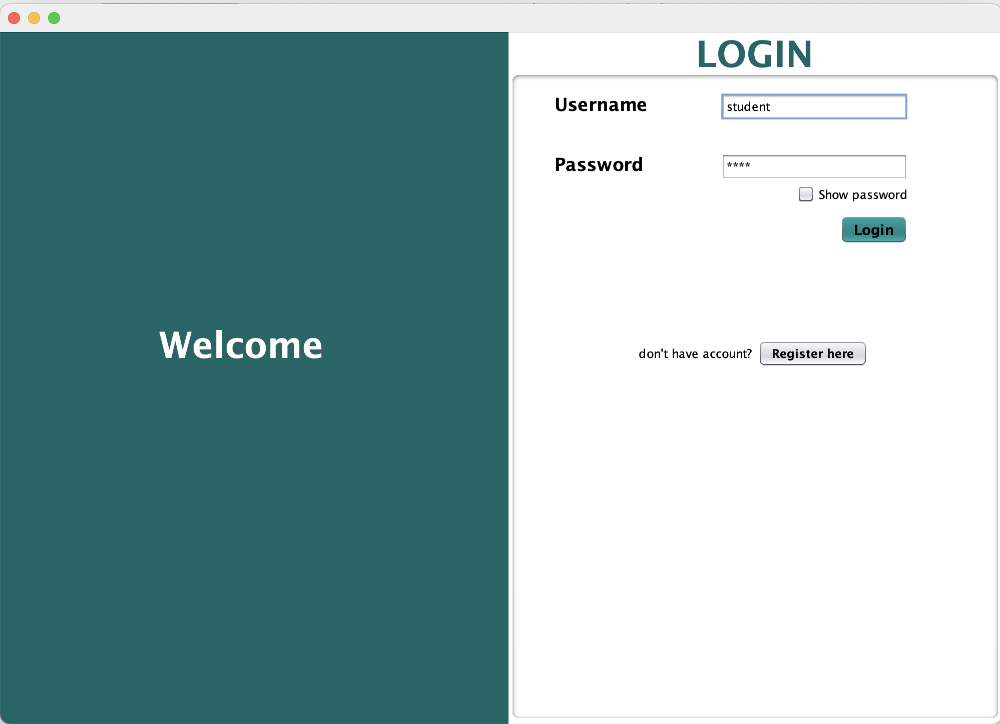

# Quiz-System-GUI

<body>

    <h1>Quiz-System-GUI</h1>

    

    <h2>Project Description</h2>

    

        The <strong>Quiz-System-GUI</strong> is a comprehensive Java-based quiz management system that caters to both 
        students and teachers through a graphical interface. It provides two main portals:
    

    <ul>
        <li><strong>Teacher Portal</strong>: Teachers can create and manage quizzes for various subjects. This allows for flexibility in subject-specific quizzes, ensuring that students are tested on relevant content.</li>
        <li><strong>Student Portal</strong>: Students can log in and take quizzes that are specific to any subject. Each quiz is timed, and students must complete the quiz within the allocated time frame to ensure fairness and challenge their knowledge under pressure.</li>
    </ul>

    <h2>Key Features</h2>

    <h3>Teacher Portal</h3>
    <ul>
        <li><strong>Create Quizzes</strong>: Teachers can add quizzes for different subjects with a custom time limit.</li>
        <li><strong>Subject Management</strong>: Quizzes are categorized by subject, providing an organized structure.</li>
        <li><strong>User-Friendly GUI</strong>: Intuitive interface for teachers to manage quiz content without hassle.</li>
    </ul>

    <h3>Student Portal</h3>
    <ul>
        <li><strong>Take Quizzes</strong>: Students can participate in quizzes for any subject they choose, with a strict time limit.</li>
        <li><strong>Timed Assessments</strong>: Each quiz has a predefined time limit that ensures students complete it under exam-like conditions.</li>
        <li><strong>Immediate Feedback</strong>: Students can get results upon completion of the quiz, improving their learning process.</li>
    </ul>

    <h2>Technologies Used</h2>
    <ul>
        <li><strong>Java</strong>: Core programming language for the system's logic.</li>
        <li><strong>Swing</strong>: Java Swing framework used for designing the graphical user interface (GUI).</li>
        <li><strong>JDBC</strong>: Java Database Connectivity (JDBC) is used to interact with a database for storing quizzes, subjects, and results.</li>
    </ul>

    <h2>System Requirements</h2>
    <ul>
        <li><strong>Java 8 or higher</strong> installed on your machine.</li>
        <li>A relational database for storing quiz data (MySQL, PostgreSQL, etc.).</li>
    </ul>

    <h2>Setup Instructions</h2>

    <ol>
        <li><strong>Clone the Repository:</strong></li>
        <pre><code>git clone https://github.com/yourusername/Quiz-System-GUI.git</code></pre>

        <li><strong>Open the Project:</strong> Import the project into your preferred Java IDE (e.g., IntelliJ IDEA, Eclipse).</li>

        <li><strong>Database Configuration:</strong> Configure the database settings in the <code>JDBC</code> connection file to point to your local or remote database.</li>

        <li><strong>Run the Application:</strong> Compile and run the application from your IDE.</li>

        <li><strong>Teacher Portal:</strong> Teachers can access the system to create quizzes by logging in through the teacher interface.</li>

        <li><strong>Student Portal:</strong> Students can log in to take available quizzes from their portal.</li>
    </ol>

    <h2>Screenshots</h2>

    <ul>
        <li><strong>Teacher Portal</strong>: Interface where teachers can create quizzes for different subjects.</li>
        <li><strong>Student Quiz Interface</strong>: Interface where students take quizzes with a countdown timer.</li>
    </ul>

    <h2>Future Enhancements</h2>
    <ul>
        <li><strong>Quiz Analytics:</strong> Teachers will be able to view detailed analytics of student performance in quizzes.</li>
        <li><strong>Multiple Question Types:</strong> Support for multiple types of questions (e.g., multiple-choice, true/false).</li>
        <li><strong>Student Progress Tracking:</strong> Track the progress and improvement of students over time.</li>
    </ul>

</body>
</html>
